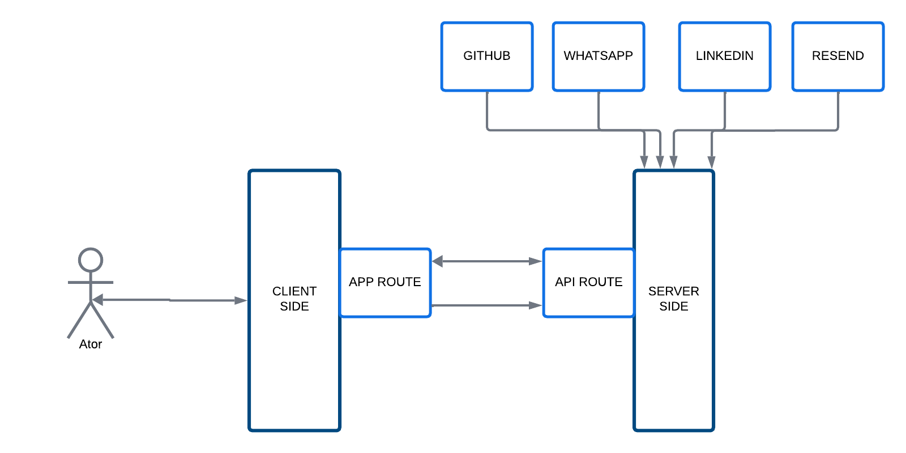

# Next.js Project 🚀

[](https://nextjs.org)
[](https://www.typescriptlang.org/)
[](LICENSE)

## Status
[](https://app.netlify.com/projects/cezarcozta/deploys)


A modern web application built with Next.js, featuring best practices and a scalable architecture.

## 🌟 Features

- ⚡️ **Next.js 15+** - For superior React development
- 📦 **TypeScript** - For type safety and better developer experience
- 🎨 **Modern UI** - Clean and intuitive user interface
- 🔒 **Best Practices** - Following industry standards and security guidelines

## 🚀 Getting Started

### Prerequisites

- Node.js 18+ 
- npm, yarn, or pnpm

### Installation

1. Clone the repository:
```bash
git clone <your-repo-url>
cd <your-project-name>
```

2. Install dependencies:
```bash
npm install
# or
yarn install
# or
pnpm install
```

3. Run the development server:
```bash
npm run dev
# or
yarn dev
# or
pnpm dev
# or
bun dev
```

4. Open [http://localhost:3000](http://localhost:3000) with your browser to see the result.

## 🏗️ Project Structure

```
├── app/                # Next.js app directory
├── components/         # Reusable components
├── lib/                # context and hooks
└── server/             # resend email integration
└── data.json           # portugues and eglish static data
```

## 🛠️ Development

You can start editing the page by modifying `app/page.tsx`. The page auto-updates as you edit the file.

## 📐 Architecture



## 📝 License

This project is licensed under the MIT License - see the [LICENSE](LICENSE) file for details.

## 🤝 Contributing

Contributions are welcome! Please feel free to submit a Pull Request.

1. Fork the Project
2. Create your Feature Branch (`git checkout -b feature/AmazingFeature`)
3. Commit your Changes (`git commit -m 'Add some AmazingFeature'`)
4. Push to the Branch (`git push origin feature/AmazingFeature`)
5. Open a Pull Request
6. Get in touch

## 📫 Contact

cezarcozta - [@cezarcozta](https://www.linkedin.com/in/cezarcozta/)

Project Link: [https://github.com/cezarcozta/me](https://github.com/cezarcozta/me)